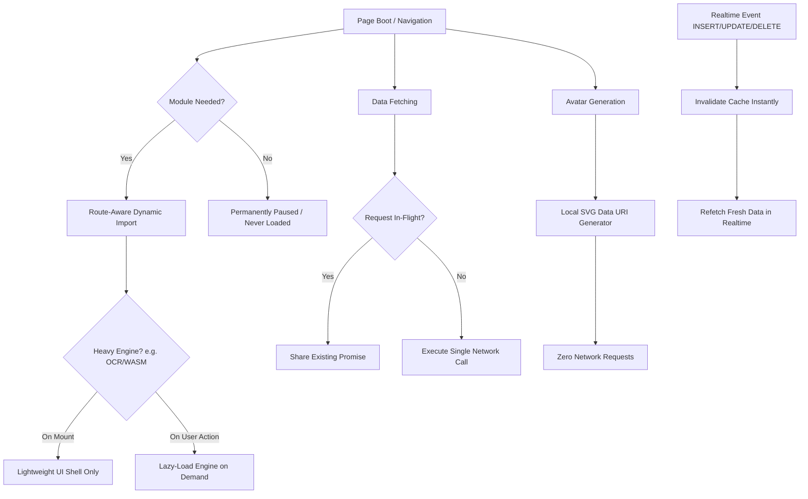

# Universal Web Application Network Optimization Guide (LLM & Engineer Skill)

> **Purpose**: A comprehensive, framework-agnostic architecture guide for optimizing web applications suffering from excessive network requests, heavy initial payloads, duplicate API queries, and third-party asset bloat. Use this guide to analyze and optimize any web system—regardless of file naming, tech stack, or directory structure.

---

## 1. Problem Diagnosis & Symptoms

### Common Symptoms
- **DevTools Network Tab Explosion**: Hundreds or thousands of requests accumulated when refreshing or navigating with "Preserve log" enabled.
- **Heavy Payload on Simple Pages**: Megabytes of JavaScript, WASM, or fonts loaded on pages that do not even utilize those features.
- **Duplicate In-Flight Calls**: The same database endpoint (e.g., `/users`, `/tickets`, `/notifications`) called simultaneously 3–6 times on initial page boot by independent components (navbar, sidebar, statistics cards, tables).
- **External CDN Dependency**: External avatar or placeholder services (e.g., `ui-avatars.com`, `gravatar.com`) firing individual HTTP requests for every entity in a table or list.
- **Uncached Status/Health Requests**: Third-party status APIs queried on every page mount or reload.

---

## 2. The 4-Pillar Optimization Architecture



---

## 3. Pillar 1: Route-Aware Code Splitting & On-Demand Engine Loading

### The Anti-Pattern
Importing every feature module into a central `main.js` or `index.js` file, causing every page in the application to download dependencies for the entire system:
```javascript
// ❌ ANTI-PATTERN: Eager imports in root bootstrap
import './modules/dashboard.js';
import './modules/staffs.js';
import './modules/tickets.js';
import './modules/ocr-converter.js'; // Imports heavy OCR WASM (~15 MB) everywhere!
```

### The Solution: Route & DOM-Aware Dynamic Imports
Only import feature modules if the target DOM elements or route path exist:

```javascript
/* START APP MODULE BOOTSTRAP - Route-aware dynamic imports */
const bootAppModules = async () => {
    // 1. Core essentials (always loaded)
    await import('@/core/auth.js');
    await import('@/components/sidebar.js');

    const pathname = window.location.pathname;

    // 2. Feature modules loaded strictly on demand
    if (document.getElementById('dashboard-metrics') || pathname.includes('/dashboard')) {
        await import('@/modules/dashboard.js');
    }

    if (document.getElementById('tickets-table') || pathname.includes('/tickets')) {
        await import('@/modules/tickets.js');
    }

    // 3. Heavy tools (OCR, video processors, 3D engines)
    // Completely paused and never loaded on other pages
    if (document.getElementById('ocr-tool-container') || pathname.includes('/ocr')) {
        await import('@/modules/ocr-converter.js');
    }
};
/* END APP MODULE BOOTSTRAP */
```

### Sub-Pattern: On-Demand Heavy Engine Loading
Even inside a heavy feature module (e.g., OCR, PDF generator, rich media editor), do **not** eagerly import the heavy runtime at file top-level. Wrap it in a lazy-getter that only resolves when the user actually triggers processing:

```javascript
/* START LAZY HEAVY ENGINE LOADER */
let engineInstance = null;
const getEngine = async () => {
    if (!engineInstance) {
        // Dynamically import WASM/heavy engine ONLY when user initiates the action
        const mod = await import('heavy-wasm-engine');
        engineInstance = mod.default || mod;
    }
    return engineInstance;
};
/* END LAZY HEAVY ENGINE LOADER */

export const processTask = async (file) => {
    const engine = await getEngine();
    return await engine.process(file);
};
```

---

## 4. Pillar 2: REST Request Deduplication with Realtime Cache Invalidation

### The Anti-Pattern
Multiple separate controllers (e.g. sidebar badge counter, dashboard counter, main data table) call `fetchData()` on page load, generating 3–5 duplicate HTTP round-trips for the exact same data.

### The Solution: In-Flight Promise Sharing + Realtime Invalidation

```javascript
/* START DATA API WITH PROMISE DEDUPLICATION & REALTIME INVALIDATION */
let inFlightPromise = null;
let cachedData = null;
let lastFetchTimestamp = 0;
const CACHE_TTL_MS = 3000; // 3-second deduplication window for initial render bursts

export const invalidateCache = () => {
    cachedData = null;
    inFlightPromise = null;
    lastFetchTimestamp = 0;
};

export const fetchData = async (forceRefresh = false) => {
    const now = Date.now();

    // 1. Return cached data if within short burst window and not forced
    if (!forceRefresh && cachedData && (now - lastFetchTimestamp < CACHE_TTL_MS)) {
        return cachedData;
    }

    // 2. Reuse in-flight promise if multiple components call simultaneously
    if (inFlightPromise) {
        return inFlightPromise;
    }

    // 3. Launch single network request
    inFlightPromise = (async () => {
        try {
            const response = await api.query('items');
            cachedData = response;
            lastFetchTimestamp = Date.now();
            return cachedData;
        } finally {
            inFlightPromise = null;
        }
    })();

    return inFlightPromise;
};
/* END DATA API WITH PROMISE DEDUPLICATION */
```

### Preserving Realtime Synchronization
When using **Supabase Realtime**, **Firebase**, or **WebSockets**, wire incoming Postgres/socket change events directly to `invalidateCache()`:

```javascript
// Supabase Realtime Listener Example
supabase
    .channel('realtime_items')
    .on('postgres_changes', { event: '*', schema: 'public', table: 'items' }, (payload) => {
        // Immediately invalidate cache so subsequent fetch gets fresh data
        invalidateCache();
        // Notify UI subscribers to refetch
        window.dispatchEvent(new CustomEvent('items:updated', { detail: payload }));
    })
    .subscribe();
```
> **Result**: Instant, zero-lag realtime updates are fully preserved, but duplicate initial page boot calls drop from N to 1.

---

## 5. Pillar 3: Local Inline SVG Avatar Generator (Zero External HTTP Calls)

### The Anti-Pattern
Using external avatar generator services:
```html
<!-- ❌ ANTI-PATTERN: External HTTP call per avatar -->

```
In a table with 20 items, this triggers 20 separate external HTTP requests to a third-party server on every single page load.

### The Solution: Self-Contained Local SVG Generator
Generate inline SVG data URIs client-side using deterministic color hashing:

```javascript
/* START LOCAL SVG AVATAR GENERATOR */
const THEME_PALETTES = [
    { bg: '#1d4ed8', text: '#ffffff' }, // Blue
    { bg: '#059669', text: '#ffffff' }, // Emerald
    { bg: '#7c3aed', text: '#ffffff' }, // Purple
    { bg: '#d97706', text: '#ffffff' }, // Amber
    { bg: '#e11d48', text: '#ffffff' }, // Rose
    { bg: '#0891b2', text: '#ffffff' }, // Cyan
    { bg: '#4f46e5', text: '#ffffff' }  // Indigo
];

export const getLocalAvatarSvg = (name = 'User', isRounded = false) => {
    const cleanName = String(name || 'User').trim();
    const parts = cleanName.split(/\s+/).filter(Boolean);
    const initials = (parts.length >= 2 
        ? `${parts[0][0]}${parts[parts.length - 1][0]}` 
        : cleanName.slice(0, 2)).toUpperCase();

    // Deterministic hash to choose consistent color for the same name
    let hash = 0;
    for (let i = 0; i < cleanName.length; i++) {
        hash = (hash << 5) - hash + cleanName.charCodeAt(i);
        hash |= 0;
    }
    const color = THEME_PALETTES[Math.abs(hash) % THEME_PALETTES.length];
    const rxAttr = isRounded ? "rx='64'" : "";

    const svg = `<svg xmlns='http://www.w3.org/2000/svg' viewBox='0 0 128 128'><rect width='100%' height='100%' fill='${encodeURIComponent(color.bg)}' ${rxAttr}/><text x='50%' y='54%' font-family='system-ui, -apple-system, sans-serif' font-size='48' font-weight='700' fill='${encodeURIComponent(color.text)}' text-anchor='middle' dominant-baseline='middle'>${initials}</text></svg>`;

    return `data:image/svg+xml,${svg}`;
};
/* END LOCAL SVG AVATAR GENERATOR */
```
> **Result**: 0 network requests, instant rendering, offline-friendly, no third-party downtime risk.

---

## 6. Pillar 4: Session Storage TTL Caching for Third-Party APIs

### The Anti-Pattern
Fetching health/status check APIs (e.g. Vercel Status, GitHub Status, System Ping) on every page refresh or view toggle.

### The Solution: Session Storage Cache with TTL

```javascript
/* START STATUS API SESSION CACHE */
const STATUS_CACHE_KEY = 'system_status_cache';
const STATUS_TTL_MS = 5 * 60 * 1000; // 5 minutes

export const fetchStatusSummary = async () => {
    // 1. Read from sessionStorage first
    try {
        const cached = sessionStorage.getItem(STATUS_CACHE_KEY);
        if (cached) {
            const { timestamp, data } = JSON.parse(cached);
            if (Date.now() - timestamp < STATUS_TTL_MS && data) {
                return data; // Instant return, 0 network requests
            }
        }
    } catch {
        // Fallback to network fetch if storage access fails
    }

    // 2. Fetch over network
    const response = await fetch('https://status.service.com/api/v2/summary.json');
    const data = await response.json();

    // 3. Cache result
    try {
        sessionStorage.setItem(STATUS_CACHE_KEY, JSON.stringify({
            timestamp: Date.now(),
            data
        }));
    } catch {
        // Storage quota full or private mode
    }

    return data;
};
/* END STATUS API SESSION CACHE */
```

---

## 7. Step-by-Step Implementation Flow for Any System

When tasked with optimizing network requests on any codebase:

1. **Step 1: Inspect Entry Points**
   - Check `main.js`, `index.js`, or `App.vue`/`App.jsx`.
   - Identify which modules are imported unconditionally.
   - Separate global shell modules (Auth, Navigation, Theme) from route-specific feature modules.
2. **Step 2: Implement DOM/Route Guards for Dynamic Imports**
   - Wrap feature imports with conditional `if (document.getElementById(...) || pathname.includes(...))` blocks.
3. **Step 3: Audit Heavy Libraries**
   - Search `package.json` for heavy dependencies: OCR (`scribe`, `tesseract`), PDF renderers, 3D engines (`three`), large chart suites.
   - Refactor these to use dynamic `import(...)` triggered on user action, never at top-level.
4. **Step 4: Add In-Flight Deduplication to Primary APIs**
   - Search for endpoints queried multiple times on load.
   - Wrap the fetch function in a promise-reuse pattern (`inFlightPromise = ...`).
   - Add an `invalidateCache()` hook and wire it to Realtime/WebSocket mutation listeners.
5. **Step 5: Replace External CDN Placeholders with Local SVGs**
   - Grep for `ui-avatars.com`, `placeholder.com`, or external icon CDNs.
   - Replace with a self-contained inline SVG data URI function.
6. **Step 6: Cache Third-Party Health/Status Requests**
   - Identify external status or widget endpoints.
   - Wrap them in a `sessionStorage` TTL cache (3–5 minutes).
7. **Step 7: Build & Validate**
   - Run `npm run build` or the project build command to verify proper chunking.
   - Verify that chunk sizes are properly distributed and heavy bundles are split out.
